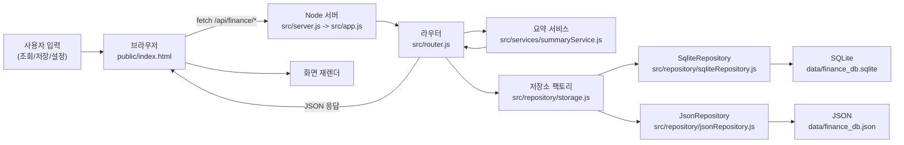

# 01. 시스템 개요

- 한 줄 요약: 이 앱은 "브라우저 화면 + Node.js API 서버 + 저장소 드라이버" 3축으로 동작하는 개인 가계부 시스템입니다.
- 언제 읽는지: 프로젝트를 처음 열었을 때, 파일을 어디서부터 읽어야 할지 모를 때
- 대상 독자: 비전공자, 초급 개발자
- 읽는 시간: 12분
- 선행 문서: `docs/guide/README.ko.md`
- 핵심 용어 3개: 라우터(Router), 저장소 드라이버(Storage Driver), 실질 식비(Effective Food)
- 코드 근거 경로: `public/index.html`, `src/server.js`, `src/app.js`, `src/router.js`, `src/services/summaryService.js`, `src/repository/storage.js`

## 3분 요약

- 사용자는 브라우저 화면에서 거래를 입력합니다.
- 브라우저는 API를 호출하고, 서버는 입력값을 검사한 뒤 저장소(SQLite/JSON)에 기록합니다.
- 서버는 저장된 데이터를 월별로 집계해 요약/알림을 반환하고, 화면은 다시 렌더링됩니다.

## 이 앱이 해결하는 문제

- 문제 1: 일일 지출 기록은 쉽지만 월말 정리가 어렵습니다.
- 문제 2: 식비에서 "내가 실제로 쓴 돈"과 "잠깐 대신 결제한 돈"이 섞이면 판단이 틀어집니다.
- 문제 3: 개인 사용 환경에서는 큰 프레임워크보다 유지비가 낮은 단순 구조가 유리합니다.

이 앱은 위 문제를 다음 방식으로 해결합니다.

- 거래를 빠르게 입력할 수 있는 단일 페이지 UI
- 식비를 실질 기준으로 계산하는 도메인 로직
- 저장소를 드라이버로 분리해 JSON/SQLite 선택 가능

## 5블록 구조

1. 브라우저 UI: 화면 이벤트를 수집하고 API를 호출 (`public/index.html`)
2. 라우터: 요청 경로별 처리와 유효성 검사 (`src/router.js`)
3. 서비스: 요약/식비 계산 같은 순수 계산 로직 (`src/services/summaryService.js`)
4. 저장소 추상화: 드라이버 선택 (`src/repository/storage.js`)
5. 데이터 파일/DB: `data/finance_db.sqlite` 또는 `data/finance_db.json`

## System Visibility 모델

### Input

- 거래 입력값: 날짜, 항목, 금액, 카테고리, 결제수단, 통화, 메모
- 조회 조건: 월, 기간, 페이지, 정렬
- 운영값: API 토큰, 식비 예산, UI 기본값(localStorage)

### Core Loop

1. 사용자가 버튼 클릭
2. 브라우저가 API 호출
3. 서버가 유효성 검사
4. 저장/조회 실행
5. 요약 계산
6. JSON 응답
7. 화면 재렌더

### Value Engine

- 월별 수입/지출 합계
- 카테고리별 지출 합계
- 실질 식비 계산으로 예산 초과 신호 제공

### Feedback Loop

- `alerts/real-food`의 `ok/warn/danger` 레벨
- 월별 코멘트로 다음 소비 행동을 조정

### Scaling Lever

- 저장소 드라이버 전환(`FINANCE_STORAGE_DRIVER=json|sqlite`)
- 라우터/서비스 분리로 로직 확장 용이
- 테스트로 회귀 감지 (`tests/api`, `tests/security`)

## 설계 의도

- [사실] 프론트는 `public/index.html` + `public/assets/js/*` 모듈 구조이며 `fetch`로 API 호출을 수행합니다.
- [사실] 서버는 `http.createServer`와 커스텀 라우터로 구성됩니다 (`src/app.js`, `src/router.js`).
- [사실] 저장소는 팩토리에서 `sqlite` 또는 `json` 구현체를 선택합니다 (`src/repository/storage.js`).
- [추론] 학습/운영 비용을 낮추기 위해 프레임워크 의존을 최소화한 구조입니다.
- [추론] 개인 금융 앱 특성상 데이터 모델보다 입력-조회 반복 속도를 우선한 설계입니다.

## 실수하기 쉬운 포인트

- 프론트에서 저장한 카테고리/결제수단(localStorage)과 서버 설정(`config/default.json`)을 같은 것으로 착각하기 쉽습니다.
- `amount`는 음수=지출, 양수=수입인데 UI에서 타입 선택과 함께 부호가 변환된다는 점을 놓치기 쉽습니다.
- 요약 API는 통화 변환을 하지 않으므로, JPY 중심 계산임을 모르고 다중 통화를 합산해 해석하면 오류가 납니다.
