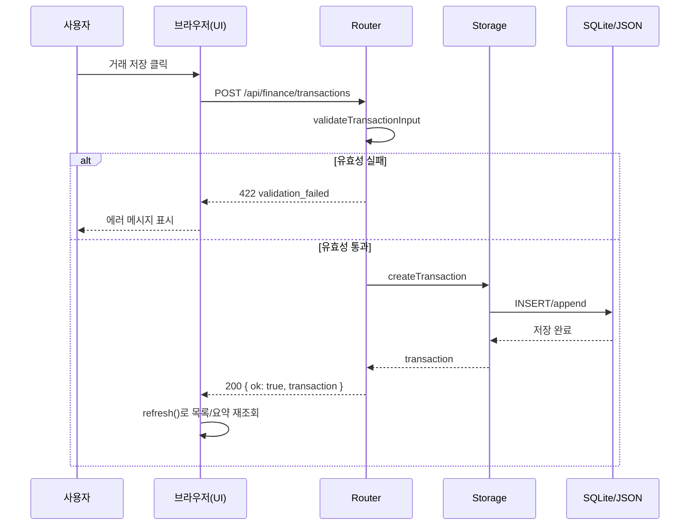
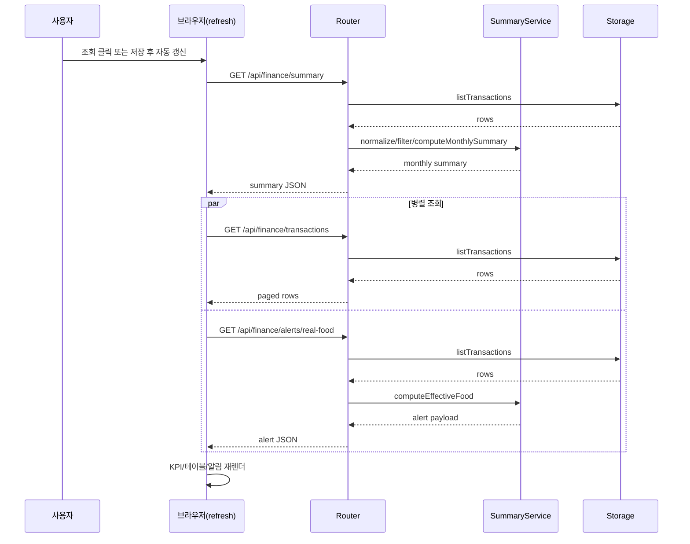

# 02. 요청 생명주기

- 한 줄 요약: 이 앱의 핵심 루프는 "이벤트 발생 → API 요청 → 유효성 검사 → 저장/집계 → 화면 갱신"입니다.
- 언제 읽는지: 아키텍처 개요를 읽은 뒤, 실제 동작 순서를 이해하고 싶을 때
- 대상 독자: 비전공자, 초급 개발자
- 읽는 시간: 15분
- 선행 문서: `docs/guide/01-system-overview.ko.md`
- 핵심 용어 3개: 요청 생명주기(Request Lifecycle), 유효성 검사(Validation), 상태 코드(Status Code)
- 코드 근거 경로: `public/index.html`, `src/router.js`, `src/services/summaryService.js`, `src/repository/sqliteRepository.js`, `src/repository/jsonRepository.js`

## 3분 요약

- 거래 저장은 `addTransaction()`이 `POST /transactions`를 호출하면서 시작됩니다.
- 조회는 `refresh()`가 `summary`, `transactions`, `alerts`를 순서/병렬 조합으로 호출해 화면을 다시 그립니다.
- 실패는 주로 `422(입력 오류)`, `401(토큰 오류)`, `404(대상 없음)`, `405(메서드 오류)`로 구분됩니다.

## 시나리오 A: 거래 저장

브라우저에서 "거래 저장" 버튼을 누르면 다음 순서로 실행됩니다.

1. `public/index.html`의 `addTransaction()`이 폼 값 정리
2. `POST /api/finance/transactions` 호출
3. `src/router.js`가 body 파싱 및 `validateTransactionInput()` 실행
4. 통과 시 `storage.createTransaction()` 호출
5. 저장 후 새 거래를 응답으로 반환
6. 프론트는 성공 메시지 표시 후 `refresh()` 호출

## 시나리오 B: 조회(대시보드 갱신)

`refresh()`는 전체 화면을 갱신하는 핵심 함수입니다.

1. 사용량 통계 `GET /usage`
2. 요약 `GET /summary`
3. 거래 목록 `GET /transactions`
4. 식비 알림 `GET /alerts/real-food`
5. 응답을 조합해 KPI/월별표/거래표 렌더링

## 실패 시나리오(422/401/404/405)

| 상태 코드 | 언제 발생하는가 | 예시 |
|---|---|---|
| 422 | 입력값 검증 실패 | 날짜 포맷 오류, amount=0, fromMonth > toMonth |
| 401 | 토큰 인증 실패 | 토큰 모드에서 `X-Api-Token` 누락/불일치 |
| 404 | 대상 리소스 없음 | 존재하지 않는 거래 ID를 PATCH/태그 수정 |
| 405 | 지원하지 않는 메서드 | `DELETE /api/finance/transactions` |

`src/router.js`의 `sendValidationFailed`, `requireApiAuth`, `sendMethodNotAllowed`가 이 분기를 담당합니다.

## 디버깅 포인트

- 저장이 안 되면 먼저 브라우저 콘솔보다 네트워크 탭에서 상태 코드를 확인합니다.
- 422라면 서버가 돌려주는 `details` 배열을 읽어 정확한 실패 규칙을 확인합니다.
- 401이라면 UI 토큰(`localStorage`)과 서버 환경변수(`FINANCE_WEB_API_TOKEN`)가 같은지 확인합니다.

## 실수하기 쉬운 포인트

- `POST /transactions` 성공 후에도 화면이 갱신되지 않으면 `refresh()` 호출 실패일 수 있습니다(토큰/네트워크 확인).
- 월 범위 조회에서 `fromMonth`와 `toMonth`를 뒤집어 넣으면 422가 발생합니다.
- 정렬 옵션(`expense_desc`, `expense_asc`)은 지출 값 기준이며 수입 중심 정렬이 아님을 놓치기 쉽습니다.
