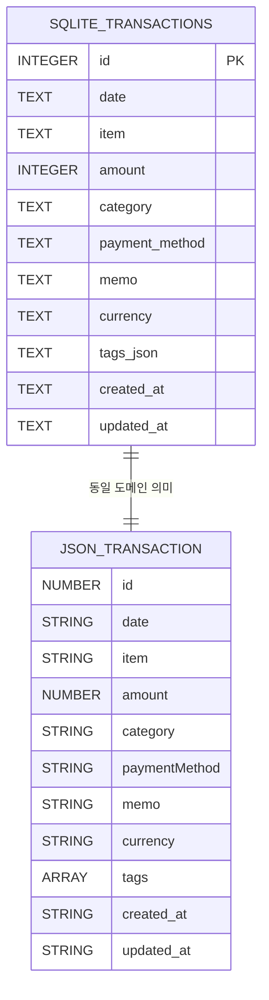

# 03. 데이터 모델과 저장 전략

- 한 줄 요약: 거래 데이터는 동일한 도메인 규칙(필드/부호/통화)을 유지한 채 JSON 또는 SQLite에 저장됩니다.
- 언제 읽는지: API 응답 필드 의미와 저장소 차이를 정확히 이해하고 싶을 때
- 대상 독자: 비전공자, 초급 개발자
- 읽는 시간: 14분
- 선행 문서: `docs/guide/01-system-overview.ko.md`, `docs/guide/02-request-lifecycle.ko.md`
- 핵심 용어 3개: 도메인 모델(Domain Model), 영속화(Persistence), 마이그레이션(Migration)
- 코드 근거 경로: `src/services/summaryService.js`, `src/repository/storage.js`, `src/repository/sqliteRepository.js`, `src/repository/jsonRepository.js`, `data/schema.sql`, `scripts/migrate-json-to-sqlite.js`

## 3분 요약

- 거래의 핵심 필드는 `id/date/item/amount/category/paymentMethod/currency/tags`입니다.
- 금액 규칙은 매우 중요합니다: 음수는 지출, 양수는 수입입니다.
- 저장소는 `FINANCE_STORAGE_DRIVER`로 선택하며, 기본값은 SQLite입니다.

## transactions 필드 의미

| 필드 | 의미 | 주의점 |
|---|---|---|
| `id` | 고유 ID(타임스탬프 기반) | 동시 입력 충돌을 줄이기 위해 timestamp+sequence 방식 |
| `date` | 거래 날짜(YYYY-MM-DD) | 포맷 오류 시 422 |
| `item` | 거래 제목 | 빈 값 금지 |
| `amount` | 거래 금액 | 0 금지, 정수만 허용, 음수=지출/양수=수입 |
| `category` | 카테고리 | 비어 있으면 오류 또는 기본값 처리 |
| `paymentMethod` | 결제수단 | 비어 있으면 오류 또는 기본값 처리 |
| `memo` | 메모 | 선택 입력 |
| `currency` | 통화 | `JPY/KRW/USD`만 허용 |
| `tags` | 태그 배열 | 배열 타입 아니면 오류 |

## 저장소 선택 구조

- `src/repository/storage.js`에서 드라이버 문자열을 읽어 구현체를 선택합니다.
- `sqlite`: `src/repository/sqliteRepository.js`
- `json`: `src/repository/jsonRepository.js`

## JSON vs SQLite 비교

| 항목 | JSON 저장소 | SQLite 저장소 |
|---|---|---|
| 파일 | `data/finance_db.json` | `data/finance_db.sqlite` |
| 장점 | 구조가 눈에 바로 보임 | 조회/동시성/확장성 유리 |
| 동시 쓰기 | 내부 writeQueue로 직렬화 | DB 트랜잭션/잠금 사용 |
| 태그 저장 | 배열 그대로 | `tags_json` 문자열 |
| 운영 기본값 | 선택 가능 | 기본 드라이버 |

## 마이그레이션 의도와 동작

`scripts/migrate-json-to-sqlite.js`는 JSON 거래를 SQLite 테이블로 옮길 때 다음을 보장하려고 합니다.

1. 스키마 생성 (`data/schema.sql`)
2. 각 거래 필드 정규화(길이 제한, 타입 정수화, 통화 대문자화)
3. `INSERT OR IGNORE`로 중복 ID 충돌 완화
4. 트랜잭션(`BEGIN IMMEDIATE`/`COMMIT`)으로 일관성 유지

즉, "형식이 다른 저장소"로 옮겨도 "도메인 의미"는 유지하는 것이 목적입니다.

## amount 부호 규칙(가장 중요한 규칙)

- `amount < 0`: 지출
- `amount > 0`: 수입
- `amount === 0`: 금지(검증 실패)

`src/services/summaryService.js`의 `normalizeTransaction()`은 이 규칙으로 `income/expense` 파생 필드를 만듭니다.

## 실수하기 쉬운 포인트

- JSON과 SQLite를 바꾸면 기존 데이터 파일 위치가 달라진다는 점을 놓치기 쉽습니다.
- `currency`가 허용 목록 밖이면 저장 자체가 실패합니다(환율 자동변환 없음).
- 태그는 배열이어야 하며, 문자열 하나를 보내면 422가 발생합니다.
