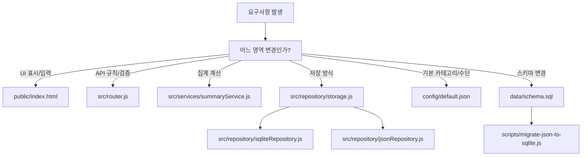

# 05. 초급 개발자 실습 가이드

- 한 줄 요약: 이 문서는 "실행 → API 호출 → 코드 추적 → 작은 변경 연습" 순서로 프로젝트를 손에 익히는 실습 안내서입니다.
- 언제 읽는지: 구조를 이해한 뒤, 실제로 실행하고 수정해 보고 싶을 때
- 대상 독자: 초급 개발자, 입문자
- 읽는 시간: 20분
- 선행 문서: `docs/guide/01-system-overview.ko.md`, `docs/guide/02-request-lifecycle.ko.md`, `docs/guide/03-data-and-storage.ko.md`
- 핵심 용어 3개: 엔드투엔드 흐름(End-to-End Flow), 진입점(Entry Point), 검증 루프(Validation Loop)
- 코드 근거 경로: `package.json`, `src/server.js`, `src/app.js`, `src/router.js`, `public/index.html`, `config/default.json`

## 3분 요약

- 먼저 서버를 켜고 API가 살아있는지 확인합니다.
- 다음으로 조회/저장 API를 직접 호출해 응답 구조를 체감합니다.
- 마지막으로 파일 읽기 순서대로 코드를 추적하고, 작은 설정 변경 연습을 합니다.

## 1) 로컬 실행

```bash
cp .env.example .env
npm run migrate:sqlite
npm start
```

브라우저 접속:

- `http://localhost:4380`

헬스체크:

```bash
curl http://127.0.0.1:4380/api/health
```

## 2) API 호출 예제

### 조회

```bash
curl "http://127.0.0.1:4380/api/finance/transactions?limit=10&page=1"
```

```bash
curl "http://127.0.0.1:4380/api/finance/summary?month=2026-02"
```

### 저장

```bash
curl -X POST "http://127.0.0.1:4380/api/finance/transactions" \
  -H "Content-Type: application/json" \
  -d '{
    "date": "2026-02-14",
    "item": "실습 점심",
    "amount": -1200,
    "category": "식비",
    "paymentMethod": "현금",
    "currency": "JPY",
    "memo": "walkthrough"
  }'
```

토큰 모드라면 `-H "X-Api-Token: ..."`를 추가해야 합니다.

## 3) 코드 읽기 순서(권장)

1. `src/server.js`: 서버 시작 진입점
2. `src/app.js`: 앱 조립(포트/호스트/저장소/라우터)
3. `src/router.js`: API 엔드포인트 동작
4. `src/services/summaryService.js`: 요약 계산 규칙
5. `src/repository/storage.js`: 드라이버 선택
6. `src/repository/sqliteRepository.js` 또는 `src/repository/jsonRepository.js`: 실제 저장
7. `public/index.html`: 화면 이벤트와 API 연결

## 4) "카테고리 추가" 변경 연습

목표: 기본 카테고리 목록에 새 항목을 추가하고 API/화면 반영을 확인합니다.

1. `config/default.json`의 `categories`에 새 키 추가
2. 서버 재시작
3. `GET /api/finance/meta` 호출로 카테고리 포함 여부 확인
4. 브라우저 새로고침 후 입력 폼 드롭다운에서 확인

참고:

- UI에서 추가한 카테고리는 브라우저 localStorage에 저장됩니다.
- `config/default.json`은 서버 기본값입니다.
- 둘은 저장 위치가 다르므로 목적에 맞게 선택해야 합니다.

## 5) 디버깅 포인트

- 저장 실패 시: 네트워크 탭에서 상태 코드 먼저 확인
- 422 시: 응답 `details` 배열의 첫 에러를 우선 수정
- 401 시: 서버 토큰 설정과 브라우저 저장 토큰 일치 여부 확인
- 요약 이상 시: `summary` 응답의 `monthly`와 `latestMonth`부터 비교

## 수정 지점 맵



## 실수하기 쉬운 포인트

- API 예제를 그대로 복사할 때 날짜 포맷(`YYYY-MM-DD`)을 틀리기 쉽습니다.
- `amount` 부호를 잘못 넣으면 수입/지출이 반대로 기록됩니다.
- 로컬 UI 기본값(localStorage)과 서버 기본값(config)을 혼동하면 "왜 안 바뀌지?" 문제가 자주 발생합니다.
